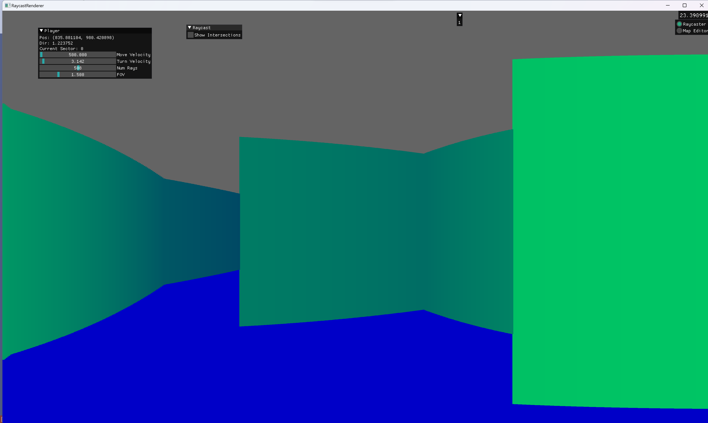
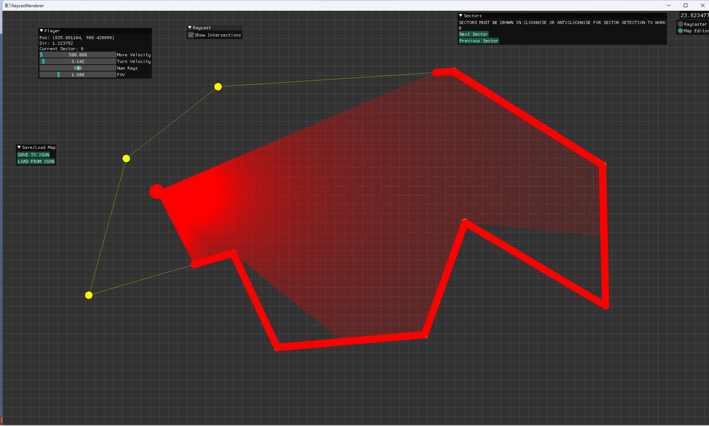
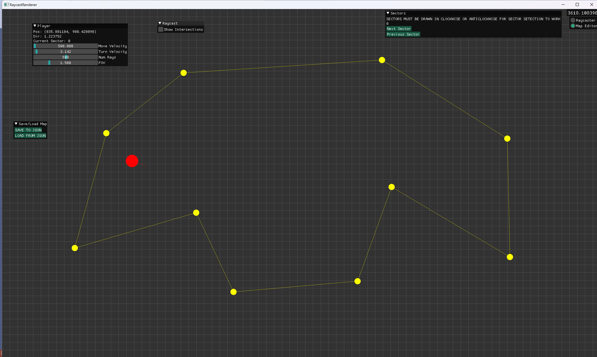

# RaycastRenderer

Render 3D environment using raycasting to map space. 
Create maps in map editor and save and load maps stored as JSON using the native filesystem.

#### Render View

#### Raycast View

#### Map Editor View
